# 🛡️ Mật mã hiện đại và Triển khai PKI (Buổi 2)

Chào mừng đến với dự án **Mật mã hiện đại và Hệ thống khóa công khai (PKI)**! Dự án này bao gồm hai phần chính: một thư viện mã hóa đa năng (crypto-toolkit) và một hệ thống Certificate Authority thu nhỏ (mini-ca).

---

## 🚀 1. Crypto Toolkit (crypto-toolkit)

Đây là một thư viện Python mạnh mẽ hỗ trợ mã hóa, băm mật khẩu và chữ ký số. Bao gồm mã hóa AES-256-GCM, tạo/ký khóa RSA và băm mật khẩu Argon2.

**Hình ảnh minh họa kết quả (Lab 1):**

*(Ảnh 1: Kết quả chạy Unit Test thành công)*
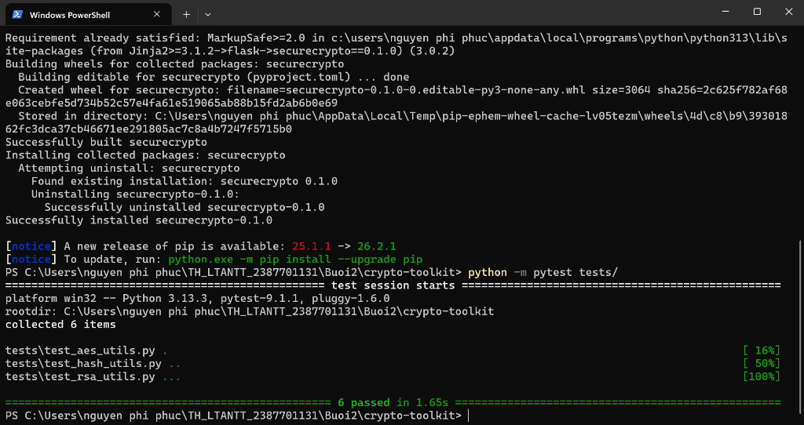

*(Ảnh 2: Kết quả mã hóa file thành công qua CLI)*
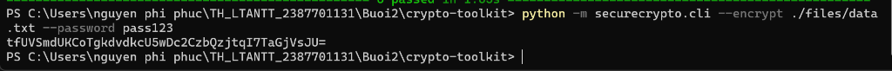

*(Ảnh 3: Kết quả giải mã file thành công qua CLI)*
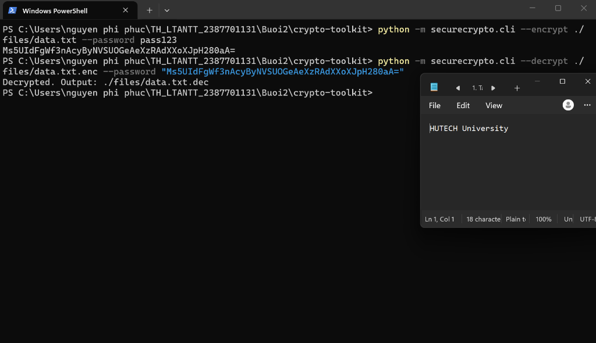

*(Ảnh 4: Giao diện đồ họa (GUI) mã hóa thành công)*
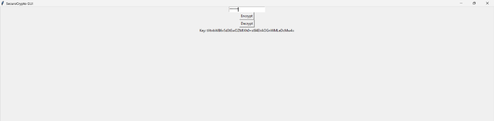

*(Ảnh 5: Khởi chạy Flask API Server)*
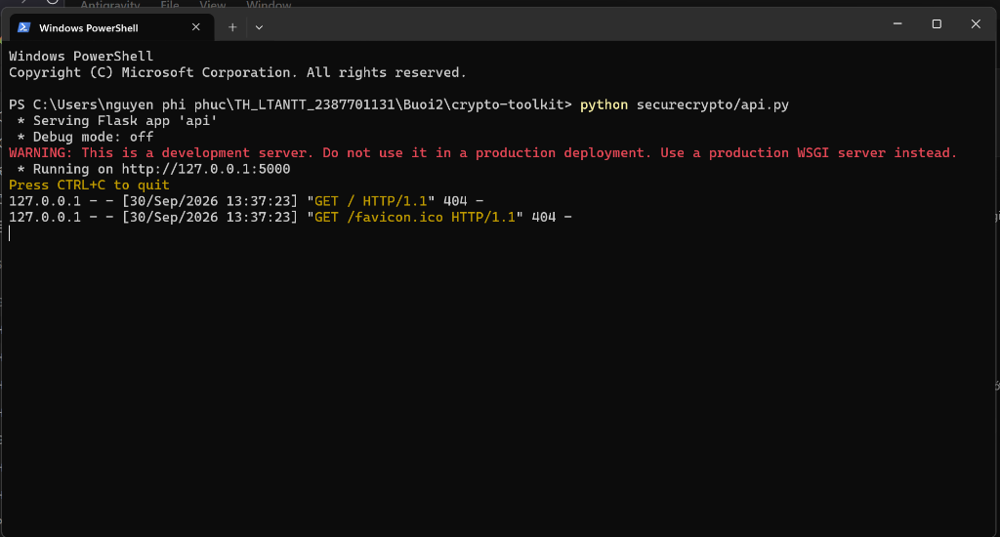

*(Ảnh 6: Test API /encrypt bằng Postman / Thunder Client thành công)*
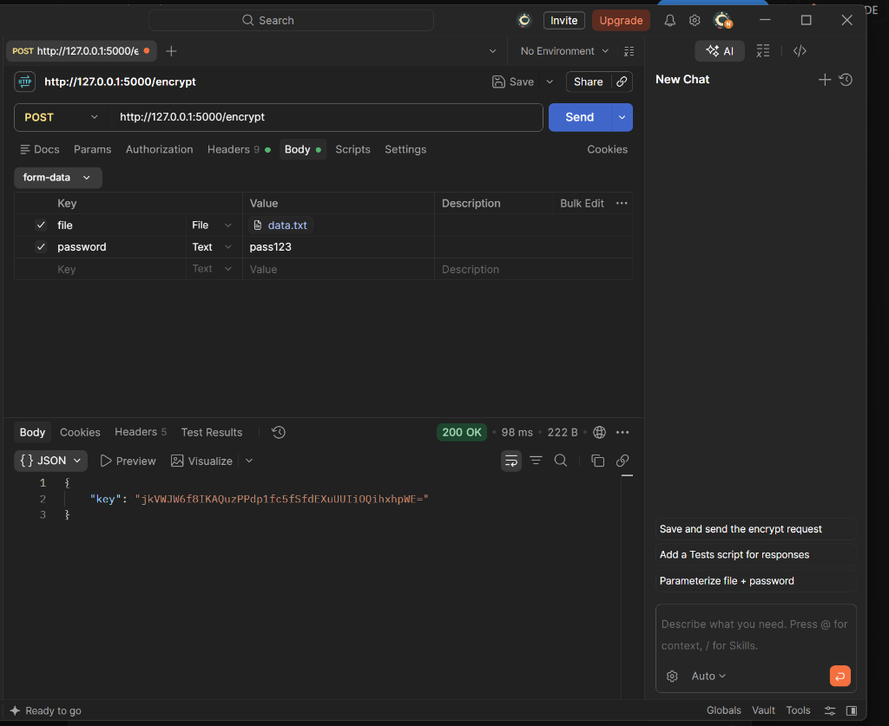

---

## 🏛️ 2. Mini Certificate Authority (mini-ca)

Hệ thống mô phỏng cấu trúc hạ tầng khóa công khai (PKI) với chuẩn chứng chỉ X.509. Hỗ trợ tạo Root CA, Intermediate CA, phát hành và thu hồi chứng chỉ.

**Hình ảnh minh họa kết quả (Lab 2):**

*(Ảnh 1: Kết quả chạy demo toàn bộ quy trình PKI qua CLI)*
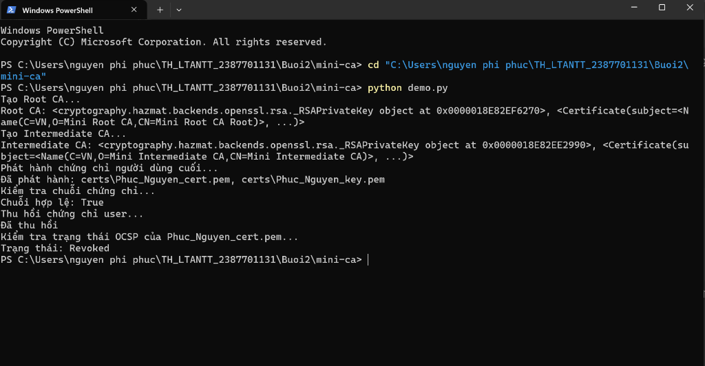

*(Ảnh 2: Các file chứng chỉ (.pem) được sinh ra thành công trong thư mục certs)*
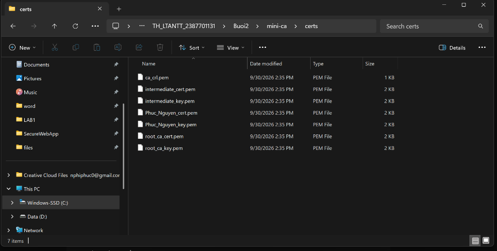

*(Ảnh 3: Khởi tạo Root CA và Intermediate CA qua GUI)*
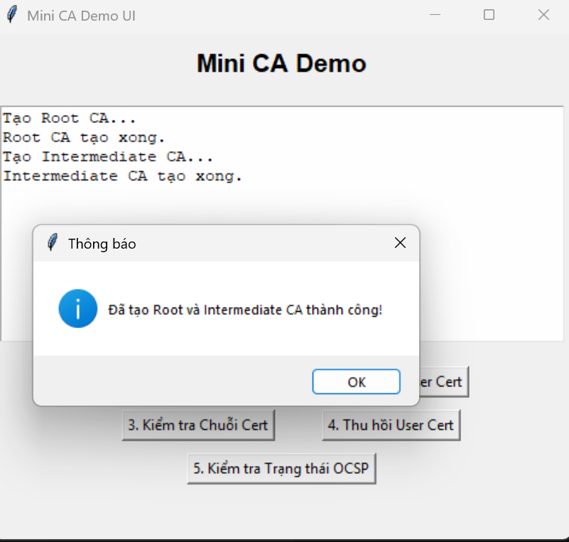

*(Ảnh 4: Phát hành chứng chỉ cho End-Entity qua GUI)*
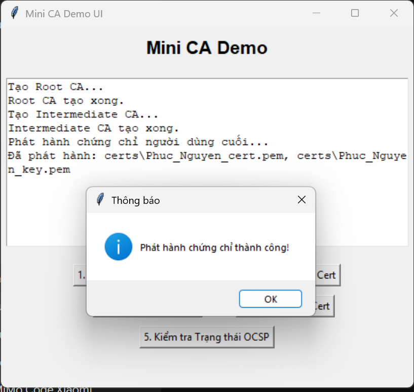

*(Ảnh 5: Xác thực chuỗi chứng chỉ (Chain of Trust) thành công)*
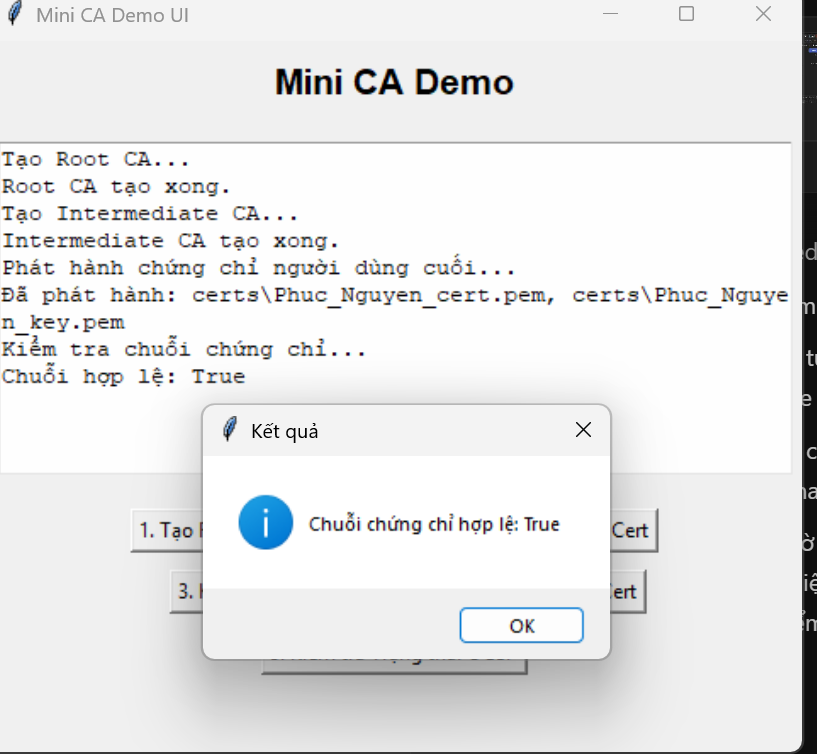

*(Ảnh 6: Thu hồi chứng chỉ)*
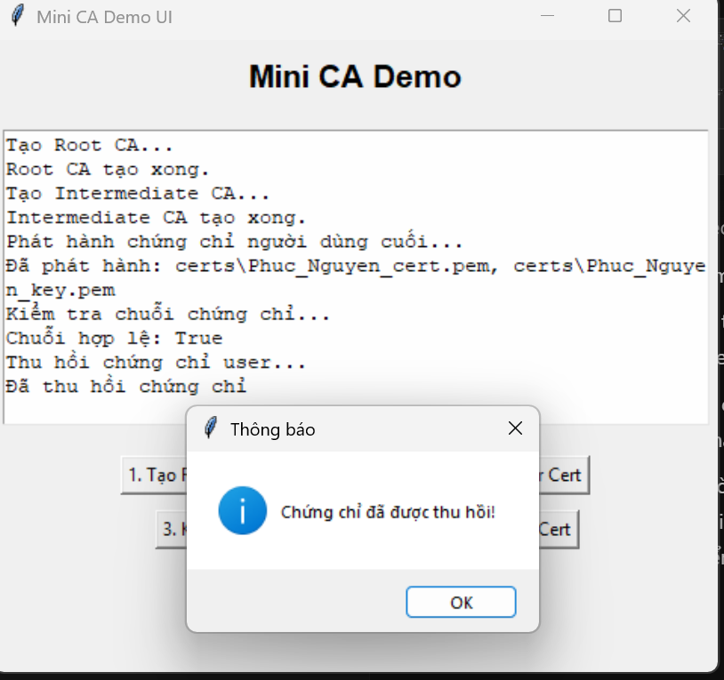

*(Ảnh 7: Kiểm tra trạng thái OCSP)*
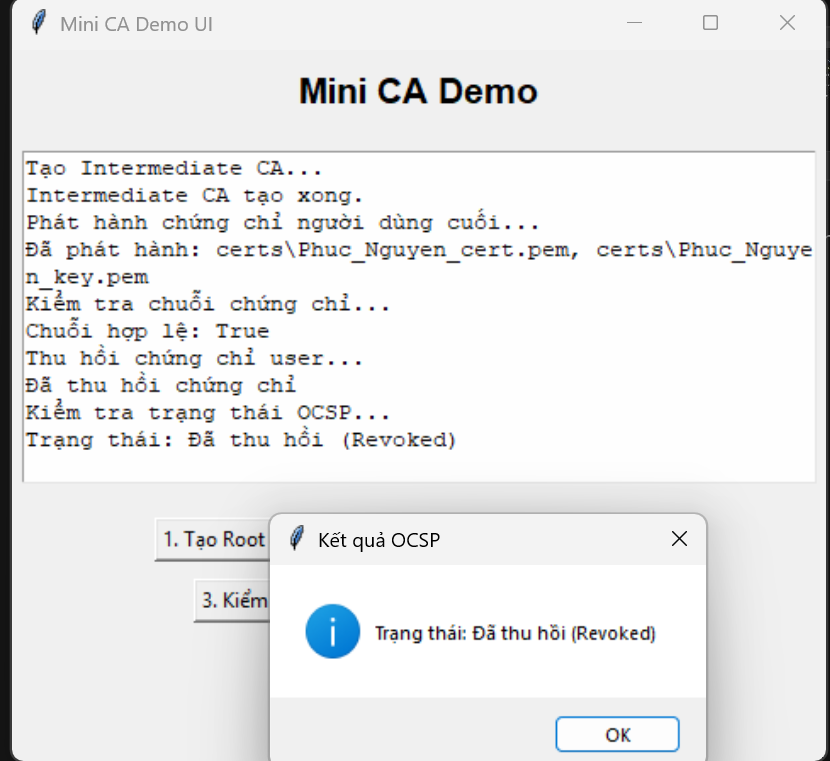

---
*Dự án thực hành thuộc môn học An Toàn Thông Tin - Phát triển bởi Nguyễn Phi Phúc - 2387701131*
