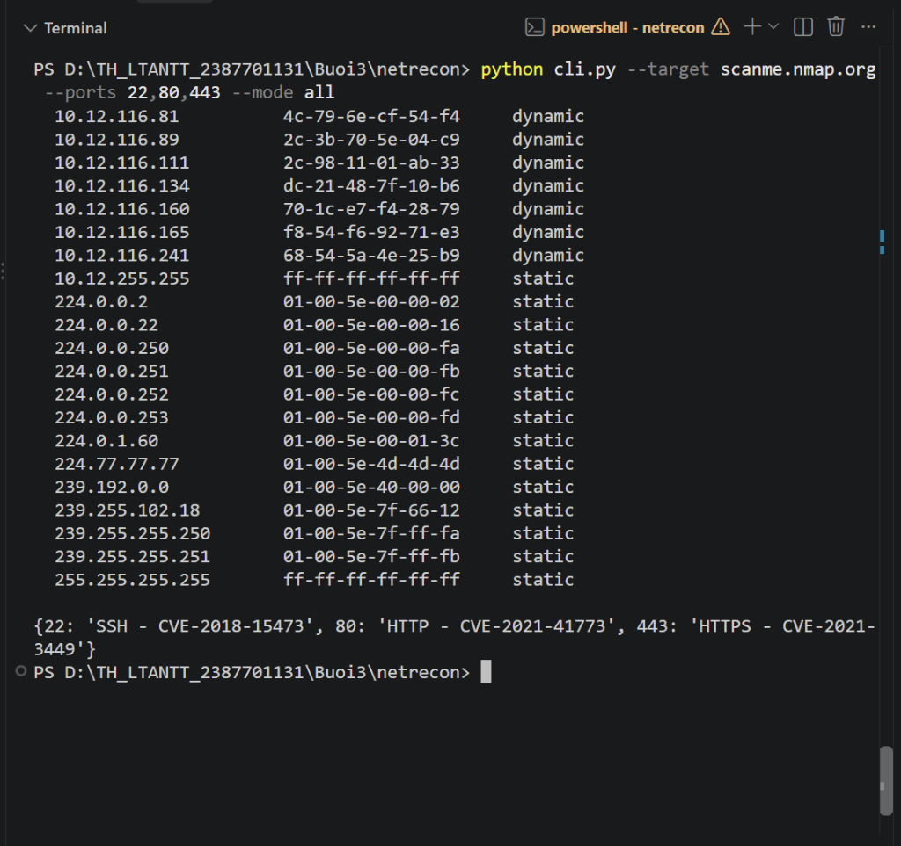
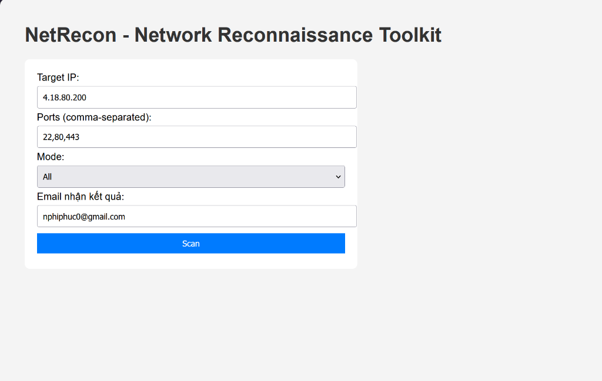
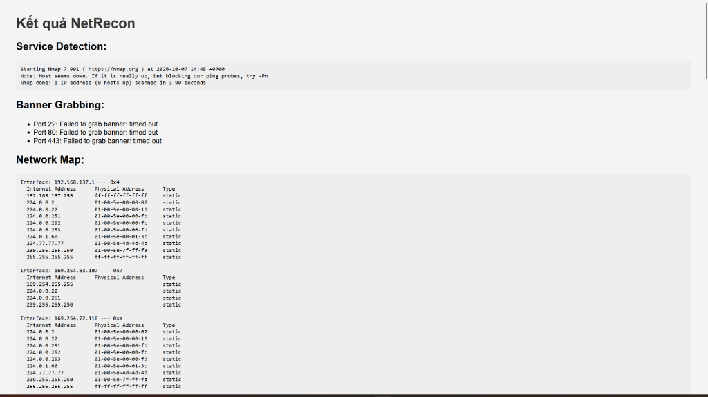
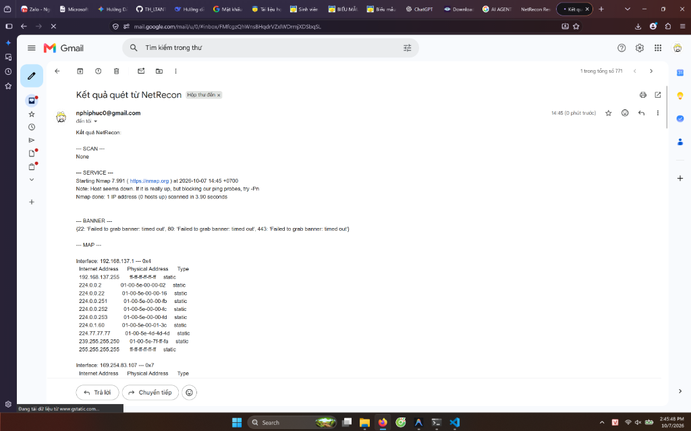

# Bài 3: Bảo mật Mạng Máy tính - Netrecon Toolkit

## 1. Giới thiệu
**Netrecon** là bộ công cụ khám phá mạng (Network Reconnaissance) được xây dựng trong Bài 3. Bộ công cụ tích hợp các chức năng như quét cổng (Port Scanning), nhận diện dịch vụ (Service Detection), bắt banner (Banner Grabbing), vẽ sơ đồ mạng (Network Mapping) và dò quét các lỗ hổng cơ bản (Vulnerability Checking).

## 2. Tính năng
Công cụ được xây dựng với hai giao diện:
- **Giao diện dòng lệnh (CLI):** Cung cấp các lệnh quét chi tiết (`cli.py`).
- **Giao diện Web (Flask):** Cung cấp Web UI nhập thông số, tự động hiển thị kết quả và gửi báo cáo quét qua Email cho quản trị viên.

## 3. Hình ảnh và Kết quả chạy thực tế

Dưới đây là minh chứng các chức năng của công cụ đã được thực thi và hoạt động thành công.

### A. Giao diện CLI - Chạy công cụ qua giao diện dòng lệnh
*Chạy tập lệnh `cli.py` với đối số chỉ định mục tiêu quét và cổng. Công cụ hiển thị Network Map (danh sách thiết bị trên mạng) và các lỗ hổng được phát hiện.*

---

### B. Giao diện Web - Web Reconnaissance Dashboard
*Cổng thông tin Web UI được xây dựng bằng Flask, cho phép người dùng nhập địa chỉ mục tiêu (Target IP), danh sách cổng (Ports), tùy chọn chế độ quét và cấu hình nhận kết quả qua email.*

---

### C. Giao diện hiển thị Kết quả Quét trên Web
*Sau khi hoàn tất quá trình quét (Scan), hệ thống trả về kết quả ngay trên giao diện web, bao gồm: Thông tin nhận dạng dịch vụ (Nmap Service Detection), Banner Grabbing và Network Map.*

---

### D. Báo cáo Kết quả qua Email
*Công cụ tích hợp tính năng cảnh báo/báo cáo tự động bằng cách gửi chi tiết kết quả quét hệ thống qua Email (sử dụng thư viện `smtplib` và Mật khẩu ứng dụng của Google).*

---
*Hoàn thành Bài 3 - Phần 3.4 Thực hành Netrecon.*
